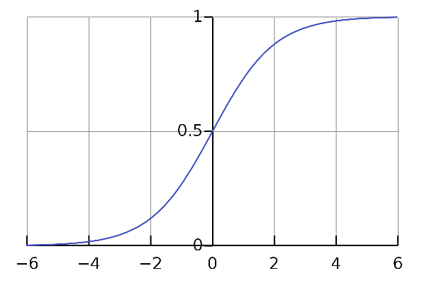

# Classification

Classification is the problem of categorizing observations (inputs) in a different set of classes(labels) based on the given set of observations.

#### Logistic Regression

Logistic Regression is one of the most simple and commonly used Machine Learning algorithms for two-class classification. It is easy to implement and can be used as the baseline for any binary classification problem. Logistic regression describes and estimates the relationship between one dependent binary variable and independent variables.

The logistic regression model computes a weighted sum of the input variables x similar to the linear regression, but it runs the result through a special non-linear function, the logistic function or sigmoid function to produce the output y. Here, the output is binary or (-1/1).

Sigmoid Function

$$ y = 1/(1 + exp(-x)) $$

Logistic regression models the probability of the class based on the weight with the help of sigmoid function.

The problem is that it can suffer from proper separation between classes. If there is a feature that would perfectly separate the two classes, the logistic regression model can no longer be trained. This is because the weight for that feature would not converge, because the optimal weight would be infinite.

On the good side, the logistic regression model is not only a classification model, but also gives you probabilities. This is a big advantage over models that can only provide the final classification. Knowing that an instance has a 99% probability for a class compared to 61% makes a big difference.

