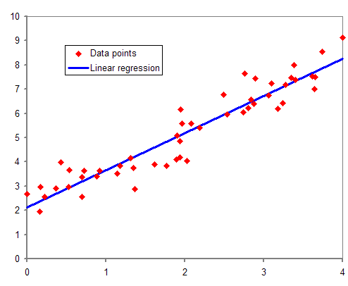
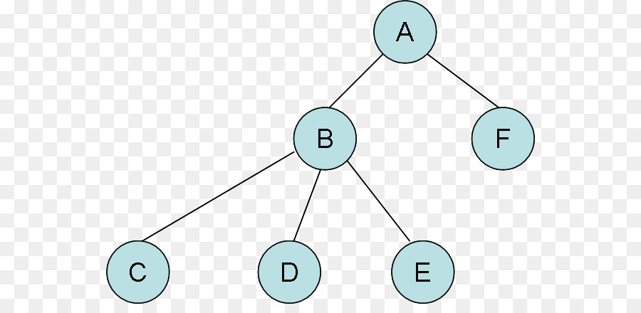

# Regression

Regression models are used to predict a continuous value. Predicting prices of a house given the features of house like size, price and linear functions is one of the common examples of regression. It is a supervised technique.

Types of Regression are:

 - Simple Linear Regression
 - Polynomial Regression
 - Support Vector Regression
 - Decision Tree Regression
 - Random Forest Regression

##### Simple Linear Regression

This is one of the most common and interesting type of Regression technique. Here we predict a target variable Y based on the input variable X. A linear relationship should exist between target variable and prediction variable.

$$Y = a + bX$$

##### Polynomial Linear Regression

A regression equation is a polynomial regression equation if the power of independent variable is more than 1. The equation below represents a polynomial equation

$$Y=a+b*X^2$$

In this regression technique, the best fit line is not a straight line. It is rather a curve that fits into the data points.

##### Decision Tree Regression

Decision tree uses a flow chart like tree structure to predict the output on the basis of input or situation described by a set of properties.

A tree is a collection of nodes connected by directed (or undirected) edges. A tree is a nonlinear data structure, compared to arrays, linked lists, stacks and queues which are linear data structures. A tree can be empty with no nodes or a tree is a structure consisting of one node called the root and zero or one or more subtrees. A tree has following general properties: 
One node is distinguished as a root ('A'); 
Every node (exclude a root) is connected by a directed edge from exactly one other node; A direction is: parent (B) -> children (C, D, E)

Decision tree regression observes features of an object and trains a model in the structure of a tree to predict data in the future to produce meaningful continuous output

